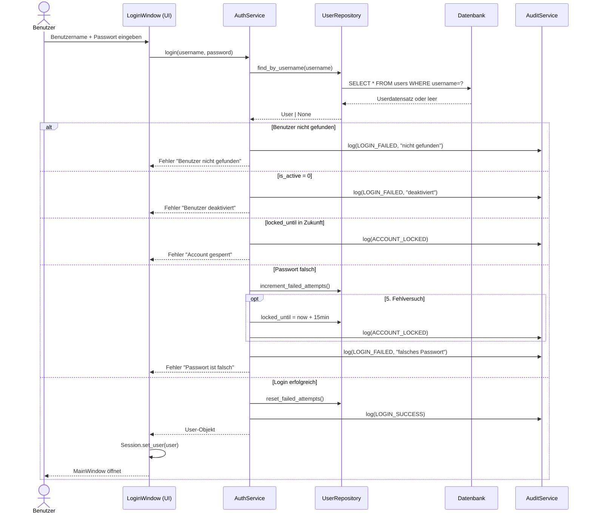
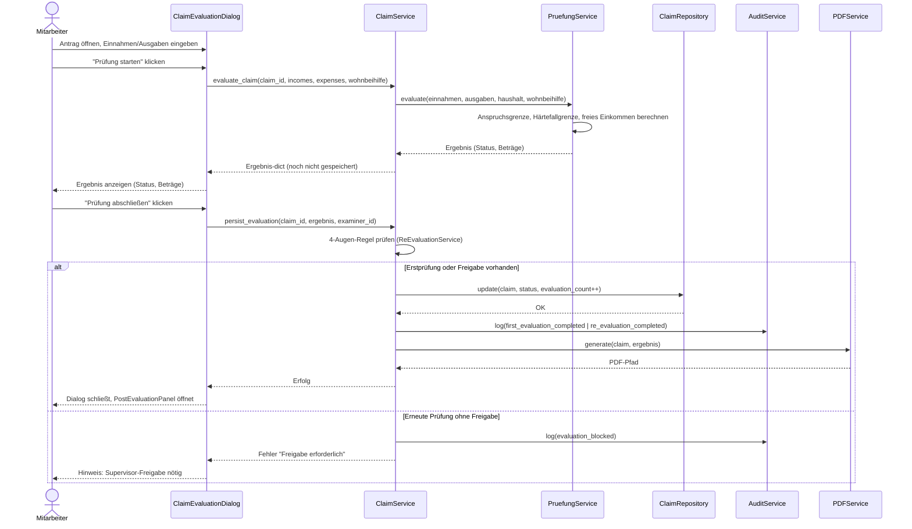
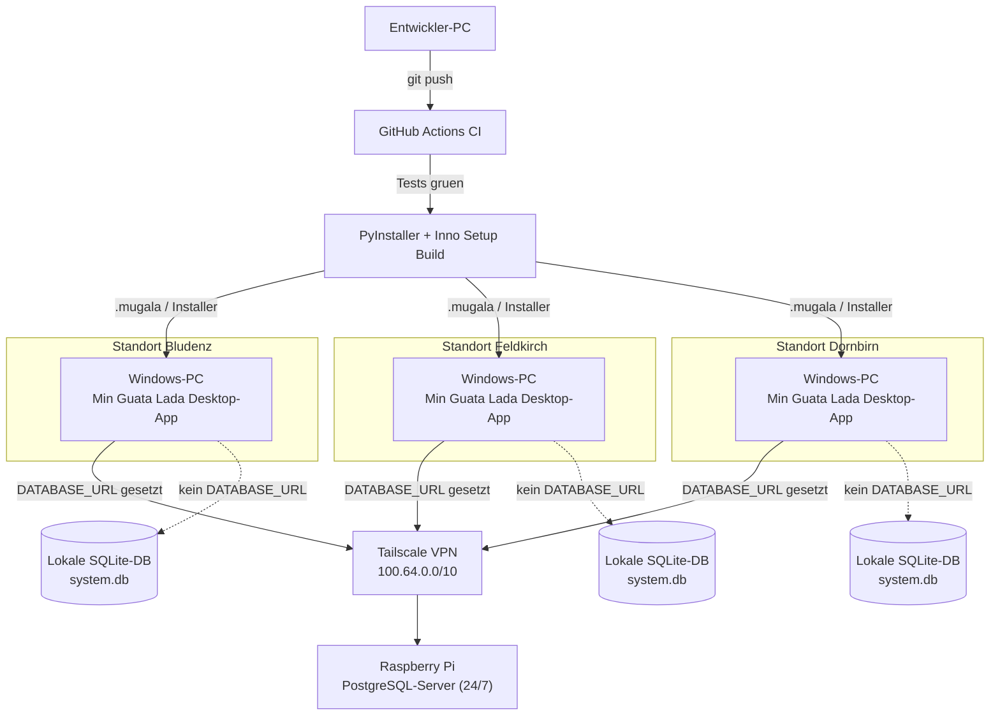

# Technical Design Document
## Min Guata Lada — Anspruchsverwaltung

| Feld | Wert |
|---|---|
| **Dokumentname** | Technical Design Document — Min Guata Lada ERP |
| **Projektname** | Min Guata Lada — Tischlein Deck Dich Vorarlberg |
| **Version** | 2.0 |
| **Status** | Draft |
| **Datum** | 2026-06-16 |
| **Owner** | Dario Schaer / Projektleitung |
| **Repository** | github.com/schienenzeit-art/minguatalada |
| **Verwandte Dokumente** | [OPERATIONS_GUIDE.md](OPERATIONS_GUIDE.md), [SECURITY_GUIDE.md](SECURITY_GUIDE.md) |

---

## 1. Zweck des Dokuments

Dieses Dokument beschreibt **Architektur, Komponenten, Datenmodell und Schnittstellen** der Software **Min Guata Lada — Anspruchsverwaltung**. Es dient als Referenz für:

- Entwicklung und Fehlerbehebung
- Onboarding neuer technischer Mitarbeitender
- Entscheidungsgrundlage für Datenbankwechsel, Cloud-Anbindung und API-Ausbau
- Nachvollziehbarkeit technischer Entscheidungen

**Seit Version 2.0 ist dieses Dokument bewusst auf Architektur/Komponenten/Datenmodell/Schnittstellen begrenzt.** Operative Themen (Vereins-PC-Diagnose, Backup/Restore, Deployment, Troubleshooting) stehen im [Operations Guide](OPERATIONS_GUIDE.md). Sicherheits- und Datenschutzthemen (Threat Model, Berechtigungen, DSGVO) stehen im [Security Guide](SECURITY_GUIDE.md). Diese Aufteilung ersetzt die bis Version 1.2 monolithische Struktur dieses Dokuments und soll die Wartbarkeit der Dokumentation verbessern.

Das Dokument ist **kein Marketingtext** und **kein akademisches Architekturpapier**. Es dokumentiert den tatsächlichen Ist-Zustand und zeigt offen auf, was stabil ist, was Risiken trägt und was noch offen ist.

---

## 2. Scope und Nicht-Ziele

### Scope
- Systemarchitektur (Schichten, Module, Datenfluss)
- Fachliche Kernprozesse (Login, Rollen, Haushalt, Anspruchsprüfung)
- Nicht-funktionale Anforderungen und Qualitätsattribute
- Sequenz- und Deploymentdiagramme
- Modul- und Komponentenbeschreibung
- Datenmodell und Datenhaltung
- Datenbankentscheidung (SQLite vs. PostgreSQL)
- API- und Integrationsdesign
- Teststrategie (Überblick)
- Architekturentscheidungen (ADRs)
- Roadmap mit Versionsverlauf

### Nicht-Ziele (siehe andere Dokumente)
- Benutzerhandbuch oder Endbenutzerdokumentation
- Vollständige API-Spezifikation (noch nicht implementiert)
- Betriebs-/Diagnosethemen → [Operations Guide](OPERATIONS_GUIDE.md)
- Threat Model, Berechtigungskonzept, DSGVO → [Security Guide](SECURITY_GUIDE.md)

---

## 3. Systemüberblick

### Was ist Min Guata Lada?
Min Guata Lada ist eine Desktop-Verwaltungssoftware für den Verein **Tischlein Deck Dich Vorarlberg**. Sie unterstützt die Mitarbeitenden bei der Prüfung, Verwaltung und Nachverfolgung von Anspruchsberechtigungen (z. B. für Lebensmittelunterstützung), der Erfassung von Haushalten und Personen sowie der Kartenausstellung für Anspruchsberechtigte.

### Fachlicher Zweck
- Antragserfassung und -verwaltung
- Anspruchsprüfung (Einnahmen-/Ausgaben-Berechnung)
- 4-Augen-Regelung für kritische Prüfentscheidungen
- Kartenausstellung und -verwaltung
- Dokumentenmanagement
- Standortübergreifende Verwaltung (Bludenz, Feldkirch, Dornbirn)
- Aufgabenverwaltung und Terminplanung
- Reporting und Auswertungen

### Betriebsmodus (Ist-Stand)
- **Lokal installiert**, auf mehreren Windows-Geräten im Vereinsumfeld
- **Dual-Backend** (seit v1.6.0): SQLite (Default, je Gerät eigene Datei) oder zentrales PostgreSQL über `DATABASE_URL`
- Produktiv im Einsatz an mindestens drei Standorten
- Bekannte Betriebsprobleme auf dem **Vereins-PC** — Diagnose siehe [Operations Guide](OPERATIONS_GUIDE.md)

---

## 4. Problem- und Risikokontext

### Kritische Probleme (bekannt, behoben)

| Problem | Ursache | Status |
|---|---|---|
| Prüfungsmatrix schließt sich unerwartet | Fehlende Exception-Behandlung + kein Schließschutz | **Behoben** (v1.1.0) |
| Login funktioniert nur als Admin (Vereins-PC) | Per-Gerät-DB, andere User manuell gesperrt (locked_until=2099) | **Behoben** (Daten, v1.1.0) |
| Verlorene Eingaben bei abgebrochenem Prüfdialog | Kein Datenverlust-Schutz im Dialog | **Behoben** (v1.1.0) |
| `mitarbeiter1` wird bei jedem Start neu angelegt | Seed-Code ohne Prüfung auf Produktivmodus | **Behoben** (v1.1.0) |
| `datetime.utcnow()` deprecated in Python 3.14 | Veraltete API-Nutzung | **Behoben** (v1.1.0) |

### Strukturelle Risiken

1. **Per-Gerät-Datenbank (ohne `DATABASE_URL`)**: Jeder Rechner hat seinen eigenen Datenstand. Änderungen an Benutzern, Sperren oder Konfiguration greifen nicht auf anderen Geräten. → Adressiert durch das PostgreSQL-Dual-Backend (ADR-007), aber nur dort wo aktiv konfiguriert.
2. **Keine zentrale Administration im SQLite-Modus**: IT-Eingriffe auf einem Gerät beeinflussen andere nicht — die lokale Datenbasis kann inkonsistent werden.
3. **Globaler Session-State**: `core.session.Session` ist eine Klassen-Variable ohne Thread-Safety. Unkritisch im Einzelplatz-Desktop-Betrieb, muss für Web/API-Betrieb ersetzt werden.
4. **Kein automatisches Monitoring**: Fehler/Exceptions landen in `app.log` (`RotatingFileHandler`), aber es gibt keine aktive Alarmierung.

---

## 5. Nicht-funktionale Anforderungen

Qualitätsattribute mit Zielwerten. Wo kein gemessener oder mit der Vereinsführung abgestimmter Wert vorliegt, ist dies explizit als Platzhalter markiert statt einen Wert zu erfinden.

| Attribut | Zielwert | Begründung / Quelle |
|---|---|---|
| **Performance** | Login < 1s, Anspruchsprüfung-Berechnung < 2s, PDF-Export < 5s (lokales Netz/VPN) | Abgeleitet aus der Architektur: lokale SQLite bzw. Pi-PostgreSQL im LAN/VPN, kein Cloud-Roundtrip. Nicht durch Lasttests verifiziert. |
| **Verfügbarkeit** | Best-effort, kein 24/7-SLA. Bei PostgreSQL-Ausfall bleibt das Gerät über lokale SQLite eingeschränkt arbeitsfähig (Dual-Backend, ADR-007) | Single-Pi-Architektur ohne Redundanz (ADR-008) — Verfügbarkeit hängt an Heimnetz/Pi-Stabilität |
| **Max. Benutzerzahl** | Bis zu 10 gleichzeitige aktive Datenbankverbindungen (`ConnectionPool(max_size=10)` in `database/db.py`); geschätzt 15–30 Gesamtnutzer über alle Standorte | `max_size=10` direkt aus dem Code. **Gesamtnutzerzahl ist ein Platzhalter — mit Vereinsführung zu verifizieren.** |
| **Backup/Recovery** | RPO ≤ 24h (täglicher/ereignisgesteuerter Backup vor jedem Update), RTO-Ziel < 30 Minuten für einen vollständigen Restore | **Platzhalter** — kein realer Restore-Test mit Zeitmessung bisher durchgeführt. Empfohlen vor dem nächsten größeren Release (siehe [Operations Guide, Abschnitt 4](OPERATIONS_GUIDE.md#4-backup-und-restore)). |

---

## 6. Fachliche Kernprozesse

### 6.1 Benutzeranmeldung
1. Loginmaske zeigt Benutzername + Passwort-Felder
2. `AuthService.login()` prüft in dieser Reihenfolge:
   - Felder nicht leer
   - Benutzer in DB vorhanden
   - `is_active == 1`
   - Rolle nicht in `NON_LOGIN_ROLES` (z. B. „Freiwillige")
   - `locked_until` nicht in der Zukunft
   - bcrypt-Passwortabgleich
3. Bei Erfolg: Session setzen, ggf. Passwort-Change-Dialog
4. Bei Fehlschlag: Fehlversuch zählen; nach 5 Fehlversuchen: `locked_until = jetzt + 15 Min`
5. Alle Login-Events (Erfolg, Fehlschlag, Sperre) in `audit_logs` protokollieren

Sequenzdiagramm siehe Abschnitt 8.1. Berechtigungs- und Sicherheitsdetails siehe [Security Guide](SECURITY_GUIDE.md).

### 6.2 Rollen und Berechtigungen

| Rolle | Prüfen | Archivieren | Administration | Freigaben genehmigen |
|---|---|---|---|---|
| Mitarbeiter | Erstprüfung | Nein | Nein | Nein |
| Standortleitung | Ja (immer) | Ja | Nein | Ja |
| Supervisor | Ja (immer) | Ja | Ja | Ja |
| Admin | Ja (immer) | Ja | Ja | Ja |
| Freiwillige | — (kein Login) | — | — | — |

Vollständiges Berechtigungskonzept: [Security Guide, Abschnitt 3](SECURITY_GUIDE.md#3-berechtigungskonzept).

### 6.3 Haushaltsverwaltung
- Einem Antrag (`claim`) sind beliebig viele Haushaltsmitglieder zugeordnet
- Mitglieder haben: Vorname, Nachname, Geburtsdatum, Beziehungstyp, optional `category_id`
- Erwachsene (Beziehungen ≠ Kind/Stiefkind/Pflegekind) können eine Kategorie erhalten
- Kategorien: Pensionist, Alleinerziehend, Menschen mit Beeinträchtigung, Familie, Sozialhilfebezieher, Freiwillige Mitarbeiter
- 20-Jahre-Alters-Alert: Kinder die das 20. Lebensjahr erreichen, lösen eine automatische Warnung aus

### 6.4 Anspruchsprüfung (Prüfungsworkflow)
1. Mitarbeiter öffnet `ClaimEvaluationDialog` für einen Antrag
2. Eingabe von Einnahmen (13 Kategorien) und Ausgaben (17 Kategorien) inkl. Nachweis-Checkboxen
3. Wohnbeihilfe-Status obligatorisch angeben (Checkbox)
4. Klick „Prüfung starten": `PruefungService.evaluate_claim()` berechnet:
   - Summen, freies Einkommen
   - Anspruchsgrenze (`BASE_LIMIT` + Zuschläge aus DB-Settings)
   - Härtefallgrenze (`Anspruchsgrenze × HARDSHIP_FACTOR`)
   - Status: ANSPRUCHSBERECHTIGT / HAERTEFALL / ABGELEHNT / VORLAEFIG_ABGELEHNT
5. Klick „Prüfung abschließen": `ClaimService.persist_evaluation()` speichert alles, erzeugt PDF-Protokoll
6. **4-Augen-Regel**: Zweite Prüfung durch Mitarbeiter nur mit Supervisor-Freigabe
7. Nach Abschluss: `PostEvaluationPanel` für Brief, Wiedervorlage, etc.

**Datenverlust-Schutz** (`ClaimEvaluationDialog`, seit v1.1.0):

| Auslöser | Verhalten |
|---|---|
| Escape-Taste / „Schließen"-Button | `reject()` → `_confirm_discard()` → Rückfrage wenn Daten vorhanden |
| Fenster-X (`closeEvent`) | `closeEvent()` → `_confirm_discard()` → Rückfrage |
| Exception in `evaluate_claim()` | try/except → Fehlermeldung, Dialog bleibt offen, Eingaben erhalten |
| Erfolgreiches Speichern | `_saved = True` → Schließen ohne Nachfrage |

Sequenzdiagramm siehe Abschnitt 8.2.

### 6.5 Backup und Restore (Kurzüberblick)

Backup/Restore ist ein operativer Vorgang — vollständige Anleitung im [Operations Guide, Abschnitt 4](OPERATIONS_GUIDE.md#4-backup-und-restore). Architektonisch relevant: Backup erfolgt per WAL-Checkpoint + Dateikopie (`shutil.copy2`), maximal 10 Backups werden vorgehalten, automatisch vor jedem Update ausgelöst.

---

## 7. Architekturüberblick

```
┌─────────────────────────────────────────────────────────────┐
│                         UI (PyQt6)                          │
│  LoginWindow │ MainWindow │ Pages │ Dialoge │ Komponenten   │
└───────────────────────────┬─────────────────────────────────┘
                            │ ruft auf
┌───────────────────────────▼─────────────────────────────────┐
│                   Services (Fachlogik)                      │
│  AuthService │ ClaimService │ PruefungService │ UserService  │
│  UpdateService │ HouseholdService │ AuditService │ ...       │
└───────────────────────────┬─────────────────────────────────┘
                            │ ruft auf
┌───────────────────────────▼─────────────────────────────────┐
│           Repositories (Datenzugriff)                       │
│  ClaimRepository │ UserRepository │ AuditRepository │ ...   │
└───────────────────────────┬─────────────────────────────────┘
                            │
┌───────────────────────────▼─────────────────────────────────┐
│      database/db.py (SQLite oder PostgreSQL via DATABASE_URL)│
│  get_connection() │ initialize_database() │ Migrationen     │
└─────────────────────────────────────────────────────────────┘
```

### Schichten im Überblick

| Schicht | Verzeichnis | Verantwortung |
|---|---|---|
| UI | `ui/` | Darstellung, Interaktion, Event-Handling |
| App-Bootstrap | `app/` | Startup, DI-Container, Konfiguration, Session |
| Core | `core/` | Enums, Konstanten, Session, domänenübergreifende Typen |
| Domain | `domain/` | Domänenobjekte, reine Fachlogik (PruefungService) |
| Services | `services/` | Fachlogik mit Datenbankzugriff, Orchestrierung |
| Database | `database/` | Repositories, Schema, Migrationen, Seed |

### Externe Abhängigkeiten

| Paket | Version | Zweck |
|---|---|---|
| PyQt6 | 6.11.0 | Desktop-GUI |
| bcrypt | 5.0.0 | Passwort-Hashing |
| reportlab | 4.5.1 | PDF-Erzeugung |
| openpyxl | 3.1.5 | Excel-Export |
| psycopg | (Dual-Backend) | PostgreSQL-Treiber, nur aktiv wenn `DATABASE_URL` gesetzt |
| fastapi | 0.136.3 | (vorbereitet, noch nicht produktiv genutzt) |
| uvicorn | 0.48.0 | (vorbereitet, noch nicht produktiv genutzt) |
| PyJWT | 2.13.0 | (vorbereitet für API-Auth) |

---

## 8. Sequenzdiagramme

### 8.1 Login



### 8.2 Anspruchsprüfung



---

## 9. Deploymentdiagramm



**Lesart**: Pro Gerät entscheidet allein das Vorhandensein von `DATABASE_URL`, ob der Zugriff über VPN auf den zentralen Pi oder gegen die lokale SQLite-Datei erfolgt — Repositories und UI bleiben in beiden Fällen unverändert (siehe Abschnitt 12, `PgConnectionAdapter`). Der Pi ist ausschließlich über Tailscale erreichbar, kein öffentliches Port-Forwarding (ADR-008).

---

## 10. Modul- und Komponentenbeschreibung

### 10.1 `app/` — Application Bootstrap

**Zweck**: Startpunkt und Dependency Injection.

| Datei | Verantwortung |
|---|---|
| `bootstrap.py` | `run_app()`: Logging, DB-Init, Qt-App, Login, MainWindow |
| `config.py` | Pfade (`DB_PATH`, `DATA_DIR`, `RESOURCE_DIR`), Secret-Key, JWT-Config |
| `container.py` | `ServiceContainer`: alle Services als Dataclass gebündelt |
| `app_registry.py` | Welche Apps für welche Rollen sichtbar sind |
| `session.py` | `Session`: Klassen-Variable, hält eingeloggten User |
| `ports.py` | Interface-Definitionen (Abstract Base Classes) für Repositories |

**Risiken**:
- `Session` ist globaler State — nicht thread-safe, nicht request-fähig. Kein Problem im Desktop-Modus. Muss für API-Betrieb ersetzt werden.
- `config.py` unterscheidet frozen/unfrozen; im Dev-Modus liegt die DB im Projektverzeichnis, im installierten Modus in `%LOCALAPPDATA%`. Das ist die Hauptursache für das Vereins-PC-Problem (Diagnose: [Operations Guide](OPERATIONS_GUIDE.md)).

### 10.2 `services/auth_service.py` — Authentifizierung

**Zweck**: Login, Lockout-Verwaltung, Audit-Logging aller Auth-Events.

**Login-Prüfkette**, **Lockout-Logik** und **Audit-Verhalten**: siehe Abschnitt 6.1 / 8.1. Sicherheitsaspekte: [Security Guide, Abschnitt 2](SECURITY_GUIDE.md#2-authentifizierung-und-autorisierung).

### 10.3 `services/claim_service.py` — Antragsverwaltung

**Zweck**: Orchestrierung des gesamten Antrags-Workflows.

Wichtige Methoden:
- `evaluate_claim()`: delegiert an `PruefungService`, gibt `dict` zurück (ohne Persistenz)
- `persist_evaluation()`: speichert Ergebnis, zählt Prüfungen, prüft 4-Augen-Sperre, benachrichtigt Supervisor nach Erstprüfung
- `update_claim_status()`: nur valide Statuses, schreibt `claim_history`
- `get_allowed_transitions()`: delegiert an `ClaimStatus.get_allowed_transitions()`

**Risiko**: Methode ist komplex (~200 Zeilen für `persist_evaluation`). Seit v1.3.0 mit vollständigen Integrationstests abgedeckt.

### 10.4 `domain/services/pruefung_service.py` — Berechnungslogik

**Zweck**: Reine, zustandslose Prüfungsberechnung ohne DB-Zugriff.

Berechnung:
```
Anspruchsgrenze = BASE_LIMIT + ADDITIONAL_ADULT_LIMIT × (Erwachsene - 1) + CHILD_LIMIT × Kinder
Härtefallgrenze = Anspruchsgrenze × HARDSHIP_FACTOR

freies_Einkommen = Summe(Einnahmen) - Summe(Ausgaben)

Status:
  freies_Einkommen ≤ Anspruchsgrenze  → ANSPRUCHSBERECHTIGT
  freies_Einkommen ≤ Härtefallgrenze  → HAERTEFALL
  sonst                               → ABGELEHNT
  Wohnbeihilfe nicht angegeben oder False → VORLAEFIG_ABGELEHNT
                                           (wenn sonst berechtigt/Härtefall)
```

Alle Grenzwerte kommen aus DB-Settings und sind über `SettingsService` änderbar. Ergebnisse tragen seit v1.3.0 eine `logic_version` (aktuell `"1.0"`), damit historische Auswertungen nach Regeländerungen korrekt interpretiert werden können.

### 10.5 `services/re_evaluation_service.py` — 4-Augen-Regel

**Zweck**: Steuert, wer wann erneut prüfen darf.

**Kernregel**: Mitarbeiter darf Antrag genau einmal eigenständig prüfen. Jede weitere Prüfung erfordert Supervisor-Freigabe. Supervisor, Admin und Standortleitung sind ausgenommen.

**Zustände**: `PENDING` → `APPROVED` / `REJECTED`. Genehmigte Freigabe wird nach der Prüfung verbraucht (`consumed_at`).

### 10.6 `services/update_service.py` — Update-System

**Zweck**: Sicheres Einspielen von Software-Updates als `.mugala`-Paket (ZIP).

**Ablauf**:
1. Validierung (Manifest, Version, Migration-Dateien vorhanden, Ed25519-Signaturprüfung seit v1.2.0)
2. Backup vor Änderungen
3. Migration ausführen (idempotent via `update_migrations`-Tabelle)
4. Erfolg/Fehler in `update_history` protokollieren
5. Installer starten und Anwendung beenden

**Sicherheitsfeature**: Destruktive SQL-Anweisungen (`DROP TABLE`, `TRUNCATE`, `DELETE` ohne `WHERE`, `UPDATE` ohne `WHERE`) in Migrationen werden erkannt und blockiert.

### 10.7 `database/db.py` und `database/connection_adapter.py` — Schema, Migration, Dual-Backend

**Zweck**: Einmaliger Aufruf `initialize_database()` beim Start — idempotent, backend-unabhängig.

**Besonderheiten**:
- `CREATE TABLE IF NOT EXISTS` für alle Tabellen
- Migrationen seit v1.5.0 über `database/migrations.py` (26 nummerierte, idempotente Migrationen) statt try/except-ALTER-TABLE-Block
- `schema_migrations`-Tabelle trackt angewandte Migrationen mit Versionsnummer und Zeitstempel
- Seed-Daten: Admin-User (immer reaktiviert), Standorte, Rollen, Kategorien, Einstellungen, Dokumenttypen, Vorlagen
- `ConnectionPool(min_size=1, max_size=10)` bei aktivem PostgreSQL-Backend

**`PgConnectionAdapter`** (`database/connection_adapter.py`) bildet ein sqlite3.Connection-kompatibles Interface auf psycopg3 ab, damit alle Repositories `with get_connection() as conn:` unverändert nutzen können — Details in Abschnitt 12.

### 10.8 Logging

`RotatingFileHandler` in `bootstrap.py` → `DATA_DIR/logs/app.log`, 2 MB pro Datei, 5 Backups. Audit-Log in separater DB-Tabelle `audit_logs`. Vollständige Event-Liste und Datenschutz-Grenzen: [Security Guide, Abschnitt 6](SECURITY_GUIDE.md#6-logging-monitoring-und-auditierbarkeit). Praktisches Log-Lesen: [Operations Guide, Abschnitt 10](OPERATIONS_GUIDE.md#10-logs-prüfen).

---

## 11. Datenmodell und Datenhaltung

### Zentrale Entitäten

| Tabelle | Beschreibung | Schlüsselfelder |
|---|---|---|
| `users` | Systembenutzer | `username`, `password_hash`, `role_id`, `is_active`, `locked_until`, `failed_attempts` |
| `roles` | Rollendefinitionen | `name` (Mitarbeiter, Standortleitung, Supervisor, Admin, Freiwillige) |
| `locations` | Standorte | `name` (Bludenz, Feldkirch, Dornbirn) |
| `categories` | Anspruchskategorien | `name` (Pensionist, Alleinerziehend, ...) |
| `persons` | Antragstellende Personen | `first_name`, `last_name`, `birth_date`, `category_id` |
| `claims` | Anträge | `case_number`, `person_id`, `status`, `evaluation_count`, `examiner_id` |
| `incomes` | Einnahmen pro Antrag | `claim_id`, `type`, `amount` |
| `expenses` | Ausgaben pro Antrag | `claim_id`, `type`, `amount`, `has_proof`, `note` |
| `household_members` | Haushaltsmitglieder | `claim_id`, `relationship`, `birth_date`, `category_id` |
| `cards` | Kundenkarten | `card_number`, `claim_id`, `status`, `expiry_date` |
| `documents` | Hochgeladene Dokumente | `claim_id`, `person_id`, `storage_path`, `status` |
| `audit_logs` | Protokollereignisse | `user_id`, `action`, `object_type`, `timestamp` |
| `claim_history` | Statusänderungshistorie | `claim_id`, `old_status`, `new_status`, `changed_by` |
| `re_evaluation_requests` | 4-Augen-Freigaben | `claim_id`, `requested_by`, `status` (`PENDING`/`APPROVED`/`REJECTED`/`CONSUMED`) |
| `update_history` | Update-Protokoll | `version`, `status`, `backup_path`, `applied_migrations` |
| `schema_migrations` | Migrationsverlauf (kein `id`, PK `version`) | `version`, `applied_at` |
| `settings` | Systemparameter | `key`, `value`, `value_type` (BASE_LIMIT, CHILD_LIMIT, etc.) |

### Antragsstatus-Zustandsmaschine

```
IN_PRUEFUNG
    ├──→ ANSPRUCHSBERECHTIGT ──→ FREIGABE_KARTE
    ├──→ HAERTEFALL
    ├──→ ABGELEHNT ──→ WIDERSPRUCH ──→ IN_PRUEFUNG (Neuprüfung)
    └──→ VORLAEFIG_ABGELEHNT ──→ IN_PRUEFUNG (nach Klärung)
                                 └──→ ABGELEHNT

Alle Statuses → ARCHIVIERT (nur privilegierte Rollen)
```

### Datenkonsistenz
- Foreign Keys sind aktiviert (`PRAGMA foreign_keys = ON` bei SQLite)
- Alle referenziellen Integritätsfehler lösen Exceptions aus
- Migrationen sind idempotent (nummeriertes Migrationsframework seit v1.5.0)
- Keine Cascading-Deletes außer bei natürlichem Eltern-Kind-Verhältnis (z. B. `claim_id → incomes`)

Datenschutzrelevante Einordnung der Felder: [Security Guide, Abschnitt 7 (DSGVO)](SECURITY_GUIDE.md#7-dsgvo--datenschutz).

---

## 12. Datenbankentscheidung

### Aktuell: SQLite (Default)

**Vorteile**: Kein Datenbankserver, kein Konfigurationsaufwand, Datei-Backup trivial, ausreichend für Einzelplatz-Desktop-Betrieb.

**Grenzen**: Kein Mehrbenutzer-Echtzeit-Betrieb (SQLite serialisiert Schreibzugriffe); kein zentraler Stand zwischen Geräten ohne `DATABASE_URL`.

### PostgreSQL-Dual-Backend (seit v1.6.0, implementiert)

`database/db.py` unterstützt SQLite (Standard) und PostgreSQL parallel, gesteuert über `DATABASE_URL`. Repository-Klassen, Services und UI bleiben unverändert; die Umschaltung erfolgt vollständig in der Datenzugriffsschicht.

| Zeithorizont | Stand | Begründung |
|---|---|---|
| **Kurzfristig (erledigt)** | Dual-Backend implementiert | SQLite bleibt Default für Entwicklung/Tests, PostgreSQL für Produktion aktivierbar |
| **Mittelfristig (in Umsetzung)** | Zentraler PostgreSQL-Server auf Raspberry Pi, erreichbar via Tailscale-VPN | Eigene Infrastruktur statt Cloud-Anbieter — Daten bleiben selbst gehostet, kein laufendes Hosting-Budget |
| **Langfristig** | PostgreSQL + API-Schicht | Skalierbar, auditfähig, mehrere Clients möglich |

### PostgreSQL-Architektur (`database/connection_adapter.py`)

`PgConnectionAdapter` bildet ein sqlite3.Connection-kompatibles Interface auf psycopg3 ab:

- **Platzhalter-Übersetzung**: `?` → `%s`
- **`INSERT OR IGNORE INTO` → `INSERT INTO … ON CONFLICT DO NOTHING`**, RETURNING wird syntaktisch korrekt *nach* ON CONFLICT angehängt
- **`RETURNING id` nur bei Tabellen mit `id`-Spalte**: Eine Whitelist (`_TABLES_WITHOUT_ID`, aktuell `schema_migrations`) schließt bekannte id-lose Tabellen aus. Für unbekannte Fälle läuft das INSERT in einem SQL-Savepoint; wirft PostgreSQL `undefined_column` (pgcode `42703`), wird zur Savepoint-Grenze zurückgerollt und ohne RETURNING erneut ausgeführt — ohne die umgebende Transaktion abzubrechen
- **`executescript()`** nutzt einen Mini-Parser (`_split_sql`), der Semikolons in `--`-Kommentaren und `'...'`-Stringliteralen (inkl. `''`-Escape) korrekt ignoriert, statt naiv auf `;` zu splitten
- **Row-Normalisierung**: `Decimal` → `float`, `datetime`/`date` → sqlite3-kompatible Strings

Weitere Bausteine:
- `database/schema_postgres.sql` — vollständiges Schema, alle Migrationen eingebettet (idempotent)
- `scripts/migrate_sqlite_to_postgres.py` — einmalige Datenübernahme, öffnet die SQLite-Quelle read-only
- `docs/SERVER_SETUP_RASPBERRY_PI.md` — Pi-Setup inkl. Tailscale/pg_hba.conf-Härtung
- **Kein Redis**: Kein Caching-/Queue-Bedarf erkennbar (ADR-006). Hinzufügen nur wenn konkrete Anforderung entsteht.

### Tests gegen beide Backends
- Alle SQLite-Tests laufen weiterhin isoliert über `tmp_path`-Fixtures (kein PostgreSQL-Server nötig, auch nicht in CI)
- `tests/test_pg_adapter_integration.py` (3 Tests) läuft zusätzlich gegen eine echte PostgreSQL-Instanz, sobald `TEST_DATABASE_URL` gesetzt ist — deckt INSERT mit id-Spalte, INSERT ohne id-Spalte und INSERT-OR-IGNORE-Konflikt ab
- Verbleibendes Risiko bei künftigen Schemaänderungen: neue id-lose Tabellen sollten zur `_TABLES_WITHOUT_ID`-Whitelist hinzugefügt werden (der Savepoint-Fallback fängt den Fall ab, kostet aber einen zusätzlichen Roundtrip)

---

## 13. API- und Integrationsdesign

### Ist-Stand
FastAPI, uvicorn und PyJWT sind installiert. `app/web_api.py` existiert als markierter Architektur-Platzhalter. Die API ist **nicht produktiv aktiv**.

### Vorbereitung (was bereits cloudfähig ist)
- Repository-Interface-Pattern (`app/ports.py`) entkoppelt Services von Datenbankdetails
- `ServiceContainer` (`app/container.py`) zentralisiert DI
- Services sind (fast) zustandslos — mit Ausnahme von `Session`

### Was für API-Betrieb noch angepasst werden muss
1. **`Session` ersetzen**: Globaler Klassen-State durch Request-Kontext (FastAPI Dependency Injection)
2. **Repository-Direktzugriffe eliminieren**: Einzelne Services nutzen `get_connection()` direkt statt Repository — muss hinter Interface
3. **Auth via JWT**: `PyJWT` ist bereit, `AuthService` braucht Token-Rückgabe

### Sinnvolle API-Endpunkte (Priorität)

| Bereich | Endpunkte | Priorität |
|---|---|---|
| Auth | `POST /auth/login`, `POST /auth/logout` | 1 |
| Benutzer | `GET/POST/PUT /users`, `PUT /users/{id}/active` | 2 |
| Anträge | `GET/POST /claims`, `GET /claims/{id}`, `PUT /claims/{id}/status` | 2 |
| Prüfung | `POST /claims/{id}/evaluate`, `POST /claims/{id}/persist-evaluation` | 3 |
| Haushalte | `GET/POST/PUT/DELETE /claims/{id}/household-members` | 3 |
| Personen | `GET/POST/PUT /persons` | 3 |
| Logs | `GET /audit-logs` | 4 |
| Backups | `POST /backups`, `GET /backups`, `POST /backups/{id}/restore` | 4 |

---

## 14. Teststrategie

Vollständige Testdokumentation: in `tests/` und im Commit-Log.

### Testpyramide

```
         ▲  [UI/Workflow]    — nicht automatisiert (PyQt-Tests aufwändig)
        ▲▲▲ [Integration]    — 108 Tests (DB-basiert, isolierte tmp-DB)
      ▲▲▲▲▲ [Service-Unit]   — mit Mocks (bestehende Tests)
    ▲▲▲▲▲▲▲ [Pure Unit]      — 48 Tests (ClaimStatus, PruefungService, Password)
```

### Testinfrastruktur
- **`conftest.py`**: Isolierte `tmp_path`-SQLite-DB pro Test, Session-Fixtures für alle Rollen
- **`pytest.ini`**: Marker `unit`, `integration`, `slow`
- **282 Tests** (279 SQLite-Tests grün ohne weitere Voraussetzungen, 3 PostgreSQL-Adapter-Tests zusätzlich grün mit `TEST_DATABASE_URL`) — Stand 2026-06-16

### Kritisch abgedeckte Bereiche

| Bereich | Tests | Datei |
|---|---|---|
| Auth (alle Szenarien) | 10 | `test_auth_service.py` |
| Status-Übergänge (alle Rollen) | 34 | `test_claim_status.py` |
| 4-Augen-Regel | 19 | `test_re_evaluation_service.py` |
| Update/Backup/Restore | 25 | `test_update_service.py` |
| Audit-Logging / kein Passwort im Log | 12 | `test_logging_audit.py` |
| Passwort-Hashing | 13 | `test_password_service.py` |
| Haushalt-Kategorien | 12 | `test_household_service.py` |
| PostgreSQL-Adapter (optional, `TEST_DATABASE_URL`) | 3 | `test_pg_adapter_integration.py` |

### CI-Integration
- GitHub Actions (`.github/workflows/ci.yml`): Tests bei jedem Push auf `main`
- Schnelle Tests (`unit`): bei jedem Commit/PR
- Slow-Tests (`slow`): im Build-Job auf `main`

---

## 15. Architekturentscheidungen

### ADR-001: SQLite als Datenbank (Default, weiterhin gültig für Einzelplatz)
**Entscheidung**: SQLite bleibt Default-Backend für Entwicklung, Tests und Einzelplatzbetrieb.
**Begründung**: Keine Serverinfrastruktur nötig, triviales Backup, ausreichend wenn Geräte isoliert bleiben.
**Konsequenz**: Kein gemeinsamer Datenstand zwischen Geräten — gilt nur noch für Installationen ohne `DATABASE_URL`.
**Revisionsauslöser**: Erledigt durch ADR-007 (Dual-Backend) für Mehrgeräte-Standorte.

### ADR-002: Pro-Gerät-Datenbank (überholt durch zentrale PostgreSQL-Option)
**Entscheidung**: Jedes Gerät hat `%LOCALAPPDATA%\Anspruchssystem\system.db`.
**Begründung**: Vereinfacht Installation, keine Netzwerkabhängigkeit.
**Konsequenz**: War die Hauptursache aller Synchronisationsprobleme und Umgebungsunterschiede.
**Revisionsauslöser**: Durch ADR-007 abgelöst — Standorte mit Mehrgeräte-Bedarf nutzen `DATABASE_URL` gegen einen zentralen Raspberry-Pi-Server.

### ADR-003: Logging im Admin-Bereich sichtbar
**Entscheidung**: `audit_logs` in DB, sichtbar über `audit_log_page`.
**Begründung**: Nachvollziehbarkeit von Login-Fehlern, Prüfungsentscheidungen, Updates. Wichtig für Datenschutz und Fehlerbehebung.

### ADR-004: Prüfungsmatrix darf nicht unbeabsichtigt schließen
**Entscheidung**: `reject()` und `closeEvent()` prüfen unsaved state.
**Begründung**: Bekannter Bug: Eingaben gingen bei Ausnahmen verloren. Datenverlust in Produktivbetrieb ist inakzeptabel.

### ADR-005: API erst modular vorbereiten, nicht sofort auslagern
**Entscheidung**: Repository-Pattern und DI-Container vorhanden, aber keine aktive API.
**Begründung**: Für Desktop-Einzelplatz unnötig. Erste Priorität: stabile, korrekte Datenhaltung. API erst wenn Cloud-Anbindung konkret wird.

### ADR-006: Kein Redis
**Entscheidung**: Redis wird nicht eingesetzt.
**Begründung**: Kein Caching-, Queue- oder PubSub-Bedarf erkennbar. Würde nur Betriebskomplexität hinzufügen.

### ADR-007: PostgreSQL-Dual-Backend statt Hard-Cutover
**Entscheidung**: `database/db.py` unterstützt SQLite und PostgreSQL gleichzeitig über `DATABASE_URL`; `PgConnectionAdapter` bildet die sqlite3-Schnittstelle nach, statt Repositories für PostgreSQL neu zu schreiben.
**Begründung**: Repository-Pattern war bereits vorhanden — ein kompatibler Adapter erlaubt produktiven Einsatz ohne jede Repository-Klasse anzufassen, und Tests/CI bleiben ohne PostgreSQL-Server lauffähig.
**Konsequenz**: Der Adapter muss SQLite-Eigenheiten aktiv nachbilden (z. B. `lastrowid`), was Sonderfälle wie id-lose Tabellen (`schema_migrations`) erfordert. Gelöst über Whitelist + Savepoint-Fallback bei `undefined_column` (pgcode 42703), siehe Abschnitt 12.
**Revisionsauslöser**: Wenn der Adapter-Overhead (zusätzlicher Savepoint-Roundtrip je INSERT in unbekannte Tabellen) messbar zum Performance-Problem wird.

### ADR-008: Eigener Raspberry-Pi-Server statt Supabase/Cloud
**Entscheidung**: Zentraler PostgreSQL-Server läuft auf einem Raspberry Pi (24/7), Zugriff ausschließlich über Tailscale-VPN (100.64.0.0/10), kein öffentliches Port-Forwarding.
**Begründung**: Daten bleiben selbst gehostet (Datenschutz, kein laufendes Cloud-Budget), Tailscale erspart komplexe Firewall-/VPN-Konfiguration.
**Konsequenz**: Verfügbarkeit hängt an Heimnetz/Pi-Stabilität statt an einem SLA-gestützten Cloud-Anbieter; Monitoring der VPN-Verbindung ist Eigenverantwortung.
**Revisionsauslöser**: Wenn Standortzahl oder Lastanforderungen einen Managed-Service rechtfertigen.

### ADR-009: Dokumentation aufgeteilt in TDD / Operations Guide / Security Guide
**Entscheidung**: Das vormals monolithische `TECHNICAL_DESIGN_DOCUMENT.md` (Version ≤ 1.2) wird ab Version 2.0 auf Architektur/Komponenten/Datenmodell/Schnittstellen beschränkt. Operative Inhalte wandern in den neuen [Operations Guide](OPERATIONS_GUIDE.md), Sicherheits-/Datenschutzinhalte in den neuen [Security Guide](SECURITY_GUIDE.md).
**Begründung**: Ein einzelnes ~800-Zeilen-Dokument mit Architektur, Betrieb und Security vermischt Zielgruppen (Entwickler vs. IT-Verantwortlicher vs. Datenschutz) und erschwert gezielte Aktualisierung einzelner Themen.
**Konsequenz**: Drei Dokumente müssen bei Änderungen einzeln gepflegt werden; Querverweise zwischen den Dokumenten müssen bei strukturellen Änderungen mitgepflegt werden.
**Revisionsauslöser**: Falls sich die Drei-Dokumente-Struktur in der Praxis als zu fragmentiert erweist.

---

## 16. Roadmap

### Versionsverlauf

Vollständige Release Notes: [CHANGELOG.md](CHANGELOG.md). Diese Tabelle zeigt nur die Kernänderung pro Version.

| Version | Datum | Kernänderung |
|---|---|---|
| 1.0.0 | 2026-05-15 | Initiales Grundgerüst: PyQt6-Desktop-App, SQLite, Login, Anspruchsprüfung, Kartenverwaltung |
| 1.0.3 | 2026-05-31 | Letzter Stand vor den Stabilitätsverbesserungen (keine strukturierten Notes) |
| 1.1.0 | 2026-06-03 | Datenverlust-Schutz im Prüfdialog, zentrales Logging, Auth-Audit-Logging, Test-Infrastruktur, CI/CD eingeführt |
| 1.2.0 | 2026-06-04 | Mehrpersonen-Erfassung, Ed25519-Signaturen für Updates, SQLite-WAL-Modus, Backup-Integritätsprüfung |
| 1.3.0 | 2026-06-04 | Architektur-Refactoring: vollständige DI, `ClaimSnapshot`-Typsicherheit, graphify-Knowledge-Graph |
| 1.4.0 / 1.4.1 | 2026-06-07 | Kurzlebige Zwischenversionen (CI-Fix, Code-Quality-Gates) am selben Tag wie 1.5.0, ohne eigene Changelog-Einträge |
| 1.5.0 | 2026-06-07 | Migration-Framework (`database/migrations.py`, 26 nummerierte Migrationen), `service_factory.py` entfernt, Inno-Setup-Installer |
| 1.6.0 | 2026-06-15 | Online-Update-Center mit direktem Installer-Download, **PostgreSQL-Dual-Backend** |
| 2.0 (Dokumentation) | 2026-06-16 | Kein Code-Release — Aufteilung der technischen Dokumentation in TDD/Operations Guide/Security Guide, NFRs, Sequenz-/Deploymentdiagramme, erweitertes Threat Model |

### Kritische offene Punkte

| Punkt | Priorität | Status |
|---|---|---|
| Zentrale Datenbank (PostgreSQL, Raspberry Pi) produktiv aktivieren | Hoch | Dual-Backend implementiert, Produktiv-Pi noch nicht aktiviert |
| Admin-UI für Log-Ansicht mit Filter | Mittel | Basis vorhanden, Filter fehlen |
| `UserService` Tests | Mittel | Offen |
| `Session` durch Request-Kontext ersetzen | Mittel | Für API-Betrieb nötig |
| Direkte `get_connection()`-Aufrufe in Services | Niedrig | Refactor für API |
| Realer Restore-Test mit Zeitmessung (RTO verifizieren) | Mittel | Offen, siehe Abschnitt 5 |
| Passwort-Mindestkomplexität erzwingen | Mittel | Offen, siehe [Security Guide](SECURITY_GUIDE.md#4-security-threat-model) |
| Automatischer Datenabgleich nach VPN-Wiederherstellung | Niedrig | Offen, siehe [Security Guide](SECURITY_GUIDE.md#4-security-threat-model) |

### Zukunft / Geplante Erweiterungen

1. **PostgreSQL-Produktivaktivierung** (kurzfristig): Code ist fertig (`connection_adapter.py`, `schema_postgres.sql`, Migrationsskript). Noch offen: Raspberry-Pi-Hardware aufsetzen, `DATABASE_URL` auf Produktivgeräten aktivieren, Migration laufen lassen.
2. **API-Schicht** (nach Pi-Aktivierung): FastAPI/uvicorn bereit, Session durch Request-Kontext ersetzen.
3. **Admin-Log-Filter**: Audit-Log-Seite um Filter (Aktion, Benutzer, Zeitraum) und Export erweitern.
4. **Monitoring**: Strukturiertes Logging mit Alerting (z. B. bei wiederholten Login-Fehlschlägen, Pi-/VPN-Ausfall).
5. **Automatisches Backup-Monitoring**: Warnung wenn letztes Backup zu alt.
6. **DSGVO-Analyse abschließen**: siehe offene Punkte in [Security Guide, Abschnitt 7](SECURITY_GUIDE.md#7-dsgvo--datenschutz).

---

## 17. Anhänge

### Glossar

| Begriff | Erklärung |
|---|---|
| Antrag / Claim | Antrag einer Person auf Anspruchsberechtigung |
| Anspruchsgrenze | Maximal zulässiges freies Einkommen für volle Berechtigung |
| Härtefallgrenze | Anspruchsgrenze × Härtefallfaktor (Standard: 1.1) |
| Prüfungsmatrix | Dialog mit Einnahmen-/Ausgaben-Tabellen zur Anspruchsberechnung |
| 4-Augen-Regel | Mitarbeiter darf nur einmal eigenständig prüfen; weitere Prüfung via Supervisor |
| Seed-Daten | Basisdaten (Rollen, Standorte, Kategorien, Admin-User), die bei jedem Start idempotent eingespielt werden |
| NON_LOGIN_ROLES | Rollen ohne Systemzugang (aktuell: „Freiwillige") |
| locked_until | Zeitstempel bis wann ein Account gesperrt ist (Lockout oder manuell) |
| .mugala | Dateiformat für Update-Pakete (ZIP mit manifest.json) |
| WAL | Write-Ahead Log — SQLite-Mechanismus für Datenkonsistenz beim Backup |
| RPO | Recovery Point Objective — maximal tolerierbarer Datenverlust im Zeitraum |
| RTO | Recovery Time Objective — Ziel-Wiederherstellungszeit nach einem Ausfall |

### Wichtige Konfigurationsparameter

| Key | Beschreibung | Default |
|---|---|---|
| `BASE_LIMIT` | Anspruchsgrenze für erste erwachsene Person (€) | 820.00 |
| `ADDITIONAL_ADULT_LIMIT` | Zuschlag pro weiterer erwachsener Person (€) | 390.00 |
| `CHILD_LIMIT` | Zuschlag pro Kind (€) | 185.00 |
| `HARDSHIP_FACTOR` | Multiplikator für Härtefallgrenze | 1.1 |
| `CASE_NUMBER_PREFIX` | Präfix für Fallnummern | AS |
| `UPDATE_MANIFEST_URL` | URL zum Update-Manifest | (leer) |
| `APP_SECRET_KEY` | Umgebungsvariable für JWT-Secret | Pflicht in Produktion |
| `DATABASE_URL` | PostgreSQL-Connection-String (Dual-Backend) | (leer → SQLite) |

### Verweise

- Operative Themen (Backup, Restore, Troubleshooting): [OPERATIONS_GUIDE.md](OPERATIONS_GUIDE.md)
- Sicherheit, Berechtigungen, DSGVO: [SECURITY_GUIDE.md](SECURITY_GUIDE.md)
- Testdokumentation: `tests/` (282 Tests, Ausführung: `python -m pytest tests/`)
- CI/CD-Workflow: `.github/workflows/ci.yml`
- Versionsverlauf im Detail: [CHANGELOG.md](CHANGELOG.md)
- Benutzerhandbuch: `Benutzerhandbuch.pdf`
- Repository: https://github.com/schienenzeit-art/minguatalada

### Zu validieren / offene Platzhalter

- [ ] Genaue Pfade auf Vereins-PC verifizieren (Windows-Benutzerprofil)
- [ ] IT-Verantwortlicher Verein: Welche manuellen Eingriffe wurden vorgenommen?
- [ ] Gesamtnutzerzahl (Abschnitt 5) mit Vereinsführung verifizieren
- [ ] RTO/RPO-Zielwerte (Abschnitt 5) durch realen Restore-Test verifizieren
- [ ] DSGVO-Analyse abschließen — siehe [Security Guide](SECURITY_GUIDE.md#7-dsgvo--datenschutz)
- [ ] Produktionsinstallation auf Vereins-PC nach v1.1.0 validieren

---

*Stand: 2026-06-16 — Version 2.0*
